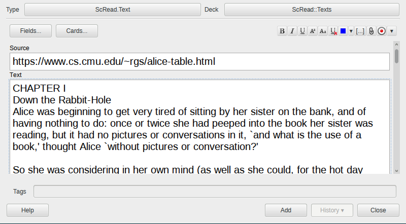
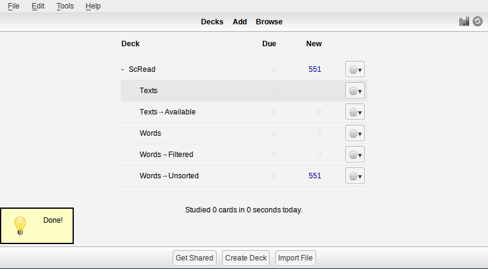

#ScRead (Anki plugin)

ScRead (short for Scrutinized Reading) is a plugin for Anki SRS.

It is a set of tools to help you read texts in a foreign language. 
In a nutshell, it ensures that you know all words in a text before
you read it, and if not, it helps you to memorize them.

## Requirements

* [Anki](http://ankisrs.net/) — a spaced repetition flashcard program
* [trans](http://www.soimort.org/translate-shell/) — Google Translate
  CLI (optional)
* [sdcv](http://sdcv.sourceforge.net/) — console version of StarDict
  (optional)

## Installation

### Manual
Copy `scread` folder and `scread_loader.py` to `addons` in your Anki's
home directory.

### Using ankiweb
(!TODO not shared yet) (parse error, не понял что это)

## Usage 

### Getting started
Open `Tools → ScRead` submenu. If this is your first time,
choose `Init`. The decks will appear.

Then read about basic flow and case for marking words. (не понял что за "case for marking words")
After that you will be ready to use the plugin.

### Basic flow
This is a description of a typical cycle of using the plugin.

##### Adding texts
Choose subdeck `Texts` and add texts you would like to read. Make sure
that type of note is set to `ScRead.Text` (see top left corner on the
screenshot). There are two fields:

* Source — the source of the text, e.g. url of an article, a book's name,
  a chapter's number of a book, etc.
* Text — the text by itself
  

Then perform parsing using `ScRead → Parse texts` submenu. There are few options:

* `all` — Parse all texts you have added. This may take a lot of
  time and result in an enormous amount of cards, so use it wisely.
* `next one` — Parse next not parsed yet text in chronological
  order. (если я правильно понял смысл)
* `next shortest one` — Parse the shortest not parsed yet text.
  This is recommended option if you add unrelated texts. (опять, если
  правильно понял смысл первой части -- к тому же, не до конца понял
  как unrelated texts связаны с shortest one)

After that new cards will appear.

##### Filtering words
Go to subdeck `Words → Unsorted`. All (new) extracted words from your texts will be
there. For each card there you should choose either `Again` or `Good`:

* `Again` means this word is new for you and you would like to learn it.
* `Good` means this word is familiar to you, so you don't need it to be learned.

Note that `Easy` button has no meaning, and each card will be checked only once.
You don't need to clear all deck at once, filtering and adding translations can be
interleaved.

##### Memoizing words
Choose `ScRead → Add translations` to supply new cards with
translations. There are few sources:

* Google Translate (via `trans` utility)
* StarDict dictionaries (via `sdcv` utility)
* Etymonline.com (works out-of-box) (!TODO Terms of service?)

To avoid abusing web services there are delays between translations,
so this stage might be quite long.

After that new words will appear in `Words → Filtered` subdeck. It's a
typical memorizing deck, use it to learn words as usual.

##### Reading texts
Choose `ScRead → Update estimations`. This will determine which texts
you will able to read and place them in `Texts → Available`
subdeck. The rule of thumb is that most of new words must be in
*mature* state (see Anki's statistics).

### Special cases
##### Updating
In order to update the plugin just replace its files, restart Anki
and choose `ScRead → Init`.

##### Clearing
In order to clean up decks choose `ScRead → Reset`. This will erase all data from ScRead decks.

##### Marking words
There are two options in `Scread → Mark words…` menu:

* `as known` — This is equal to choosing `Good` for all cards in
  `Words → Unsorted` subdeck. It's useful when you add easy texts to
  mark all the words as well-known, so they won't bother you in the
  future.
* `as unknown` — This is equivalent to choose `Again` for all cards
  in `Words → Unsorted` subdeck. It's useful when you have read a lot
  of texts, so it's unlikely to encounter a familiar word. (совсем не
  понял логики, тут написано "полезно когда читаешь много текстов, так что
  шанс встретить знакомое слово маловат")

## License
ScRead is licensed under GPL3.

[Stemming algorithm](http://tartarus.org/~martin/PorterStemmer/) by Martin Porter is licensed under BSD-compatible license.

