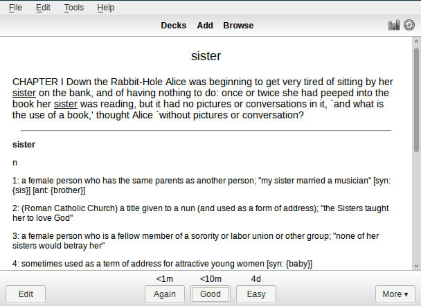

#ScRead (Anki plugin)

ScRead (short for Scrutinized Reading) is a plugin for Anki SRS.

It is a set of tools to help you read texts in a foreign language. 
In a nutshell, it ensures that you know all words in a text before
you read it, and if not, it helps you to memorize them.

## Requirements

* [Anki](http://ankisrs.net/) — a spaced repetition flashcard program
* [trans](http://www.soimort.org/translate-shell/) — Google Translate
  CLI (optional)
* [sdcv](http://sdcv.sourceforge.net/) — console version of StarDict
  (optional)

## Installation

### Manual
Copy `scread` folder and `scread_loader.py` to `addons` in your Anki's
home directory.

### Using ankiweb
(!TODO share on ankiweb)

## Usage 

### Getting started
Open `Tools → ScRead` submenu. If this is your first time,
choose `Init`. The decks will appear.

### Basic flow
This is a description of a typical cycle of using the plugin.

##### Adding texts
Choose subdeck `Texts` and add texts you would like to read. Make sure
that type of note is set to `ScRead.Text` (see top left corner on the
screenshot). There are two fields:

* `Source` — the source of the text, e.g. url of an article, a book's name,
  a chapter's number of a book, etc.
* `Text` — the text by itself
  

Then perform parsing using `ScRead → Texts…` submenu. There are few options:

* `all` — Parse all texts you have added. This may take a lot of
 time and result in an enormous amount of cards, so use it wisely.
* `next one` — Parse next not parsed yet text in chronological
 order. 
* `next shortest one` — Parse the shortest not parsed yet text.
 This is recommended option if you add unconnected texts. 

After that new cards will appear.

##### Filtering words
Go to subdeck `Words → Unsorted`. All (new) extracted words from your
texts will be there. For each card there you should choose either
`Again` or `Good`:

* `Again` means this word is new for you and you would like to learn it.
* `Good` means this word is familiar to you, so you don't need it to
  be learned.

Note that `Easy` button has no meaning, and each card will be checked
only once.
You don't need to clear all deck at once, filtering and adding
translations can be interleaved.

##### Memorizing words

Choose `ScRead → Words… → add translations` to supply new cards with
translations. There are few sources:

* Google Translate (via `trans` utility)
* StarDict dictionaries (via `sdcv` utility)
* Etymonline.com (works out-of-box) 

To avoid abusing web services there are delays between translations,
so this stage might be quite long.

After that new words will appear in `Words → Filtered` subdeck. It's a
typical memorizing deck, so use it to learn words as usual.

##### Reading texts

Choose `ScRead → Texts… → update estimations`. This will determine
which texts you will able to read and place them in `Texts →
Available` subdeck. The rule of thumb is that the most of new words
must be in *mature* state (see Anki's statistics).

### Special cases

##### Updating
In order to update the plugin just replace its files, restart Anki
and choose `ScRead → Init`.

##### Clearing
In order to clean up decks choose `ScRead → Reset`. This will erase
all data from ScRead decks.

##### Marking words
There are two options in `Scread → Words…` menu:

* `mark as known` — This is equal to choosing `Good` for all cards in
  `Words → Unsorted` subdeck. It's useful when you add easy texts to
  mark all the words as well-known, so they won't bother you in the
  future.
* `mark as unknown` — This is equivalent to choose `Again` for all cards
  in `Words → Unsorted` subdeck. It's useful when you have read a lot
  of texts, so it's unlikely to encounter a familiar word that is not
  in Anki's database.

##### Scraping web-pages
In case of big amount of web articles there may be taken a benefit of
scraping feature. To use it add new text with field `Source` filled
with a url and empty `Text` field. After that choose `ScRead → Text… → fetch`.
`Text` field will be filled with page contents and the note will be tagged as `fetched`.

Heuristic algorithm that extracts contents in the most cases does fine
with a portion of surfeit texts like comments and links to related
articles. That's why the note is tagged, so it should be checked and
edited if necessary.

That's not perfect but much better than manual copying from browser.

##### Loading texts from files
Like in the previous case texts can be loaded from local filesystem. The files
will be loaded "as is", without scraping procedure.

It's better to specify absolute path, like `C:\books\chapter1.txt` or
`~/books/chapter1.txt`.

##### Batch loading/scraping
In case of big amount of articles it may be tiresome to add note for
each url. This may be accomplished with `ScRead.Batch` notes. 

Add a new note with `List` field filled with list of urls, each one on
a separate line. Both local and remote urls can be specified. In the
next invocation of `ScRead → Text… → fetch` corresponding notes will
be created and filled.

## License
ScRead is licensed under GPL3.

[Stemming algorithm](http://tartarus.org/~martin/PorterStemmer/) by
Martin Porter is licensed under BSD-compatible license.

## Changelog
### 0.3.0 (2015-06-07)
* Fixed compatibility issues with trans and sdcv.

### 0.2.0 (2015-04-12)

* Added scraping feature.
* Added batch model.
* Some bugs are fixed.

### 0.1.0 (2015-03-23)

* All basic functions are implemented. Some testing required.

